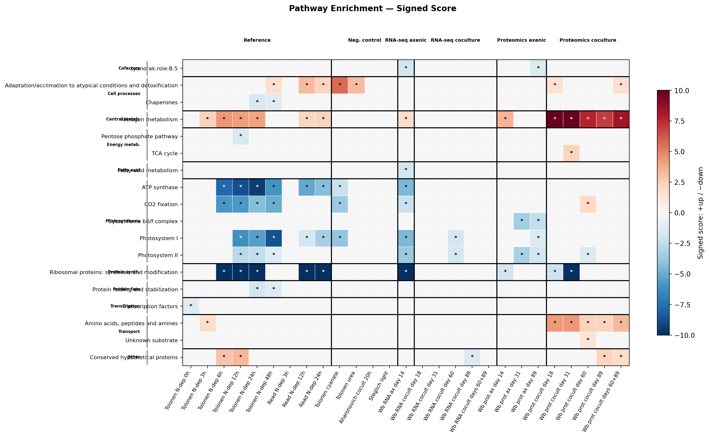

# Pathway Enrichment Analysis B1

**Question:** Which functional pathways are enriched among differentially expressed genes in each Weissberg 2025 condition/timepoint?

**Approach:** Systematic ontology annotation landscape survey, ranked ontology selection (CyanoRak level 1), and Fisher's exact pathway enrichment testing across 10 experiments.

**Predecessor:** `analyses/2026-04-08-1038-n_limitation_signature_v2/` (Approach A: reference signature scoring)

## Key findings

- **18 pathways enriched** across 133 significant tests (padj < 0.05) from 5,589 total
- **RNA/protein discordance resolved:** N-metabolism (E.4) and amino acid transport (Q.1) are strongly enriched in proteomics coculture but absent in RNA-seq coculture — Alteromonas suppresses the transcriptional N-stress response while the proteome retains it
- **Photosynthesis and ribosomal shutdown** in references and RNA-seq axenic, consistent with canonical N-deprivation
- **CyanoRak level 1** selected via genome_coverage metric (80% coverage, 110 terms) — level 2 incorrectly appeared best until genome_coverage was added
- **Signed enrichment score** (+up/−down) enables single-heatmap visualization of the full enrichment landscape

## Primary figure



## Key files

- [Research notebook](exploration/2026-04-09-notebook.md)
- [Methods](methods.md) — publication-ready
- [Decisions](decisions.md) — ontology selection, background set, signed score
- [Caveats](caveats.md) — interpretation limitations
- [Gaps and friction](gaps_and_friction.md) — MCP tool requirements, methodology friction
- [Design spec](superpowers/spec.md)
- [Implementation plan](superpowers/plan.md)

## Reusable outputs

- **`enrich_utils/`** — pathway enrichment utility package (extraction, hierarchy roll-up, survey, enrichment, signed score). Candidate for productization into `multiomics_explorer`.
- **`results/ontology_ranking.csv`** — ranked ontology comparison for MED4. Reusable for future enrichment analyses.
- **MCP tool requirements** in `gaps_and_friction.md` — concrete specs for `ontology_landscape` and `genes_at_ontology_level` tools.

## Reproduction

```bash
# From multiomics_research root. Requires Neo4j + multiomics_explorer.
uv run analyses/2026-04-09-1713-pathway_enrichment_b1/scripts/01_extract_annotations.py
uv run analyses/2026-04-09-1713-pathway_enrichment_b1/scripts/02_survey_landscape.py
uv run analyses/2026-04-09-1713-pathway_enrichment_b1/scripts/03_define_pathways.py --ontology cyanorak_role --level 1 --min-genes 5
uv run analyses/2026-04-09-1713-pathway_enrichment_b1/scripts/04_run_enrichment.py
uv run analyses/2026-04-09-1713-pathway_enrichment_b1/scripts/05_plot_results.py
```
